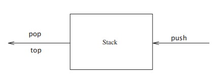
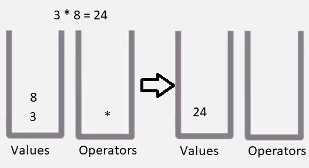
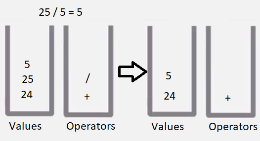
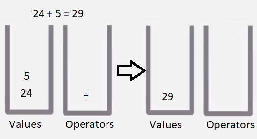
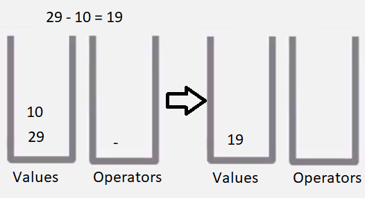

# Lab 04: The Stack Calculator 

## 1. Introduction 
Today you will implement Dijkstra's two stack algorithm in order to create a working calculator. The goal of this lab is to give you a deeper understanding of the stack data structure. 


## 2.0 STL & Stacks
The STL (Standard Template Library) is a library of data structures for storing data. There are several data structures included in this library each with their own advantages and disadvantages. One of the data structures within the STL library are stacks.

Stacks are sometimes known as LIFO (last in, first out) lists. Stacks are a handy stand-in for dynamic arrays in C++, and are extremely useful when we want to ensure data is either inserted or deleted in only one position. This position is referred to the **top** of the stack. 


> Fig 2.0 An example of a Stack. The figure above displays how the array: 6, 3, 1, 4, and 2 would appear if it was inserted, from the start of the array, into a stack. 


#### 2.1 Understanding Stacks Fundamental Operations 

The fundamental operations that can be performed on a stack and push, pop and top.

**Push** is the equivalent to "insert" except it *inserts an item to the top* of the stack. 

**Pop** is equivalent to "delete" except it  *deletes an item from the top* of the stack.

**Top** will *return the element* that is at the *top* of the stack. 




 > Fig 2.1 Stack Functionality. The figure above displays that **pushes** are the only *input* operations and **pops and tops** are *output* operations.

 #### 2.2 Stack Syntax 

**Stack Initialization** 

```c++
#include <stack>

int main() {
	std::stack<int> vec;
}

```


**Push & Pop**
```c++
#include <iostream>
#include <stack>

int main () {

  std::stack<int> myStack;

  for (int i = 1; i <= 5; i++){
        myStack.push(i);
  } 

  std::cout << "Popping out elements...";
  while (!myStack.empty()) {
     std::cout << ' ' << myStack.top();
     myStack.pop();

  }

  std::cout << std::endl;

  return 0;
}
```
**Output:** 
>Popping out elements... 5 4 3 2 1


**Top**
```c++
#include <iostream>
#include <stack>

int main () {
  std::stack<int> myStack;

  myStack.push(10);
  myStack.push(20);

  myStack.top() -= 5;

  std::cout << "myStack.top() is now " << myStack.top() << std::endl;

  return 0;
}
```
**Output:** 
>myStack.top() is now 15

**Empty**
```c++
#include <iostream>
#include <stack>

int main () {
  std::stack<int> myStack;
  int sum (0);

  for (int i=1 ; i <= 10 ; i++) {
      myStack.push(i);
  } 

  while (!myStack.empty()) {
     sum += myStack.top();
     myStack.pop();
  }

  std::cout << "Total: " << sum << std::endl;

  return 0;
}
```
**Output:**
>Total: 55

**Size**
```c++
#include <iostream>
#include <stack>

int main () {
  std::stack<int> myStack;
  std::cout << "0. Size: " << myStack.size() << '\n';

  for (int i = 1; i <= 5; i++){
        myStack.push(i);
  } 
  std::cout << "1. Size: " << myStack.size() << '\n';

  myStack.pop();
  std::cout << "2. Size: " << myStack.size() << '\n';

  return 0;
}
```
**Output:** 
>0. size: 0
>1. size: 5
>2. size: 4

## 3.0 Dijkstra's Two Stack Algorithm

Writing a program that would be able to evaluate complicated arithmetic would be difficult. This is where Dijkstra's Two Stack Algorithm comes to make our day a little easier!
In 1960, Dijkstra came up with an algorithm that evaluates arithmetic expression with the usage of two stacks. **One stack will contain the numerical values** and **the other stack will contain the operators.**  

The steps of the algorithm will look something like this:

for input in expression
1. if input == number -> push into values stack
2. if input == operator -> push into operator stack
3. if input == left parenthesis ( or space ) -> Ignore
4. if input == right parenthesis 
    1. pop first value ( will act as **second** number in operation )
    2. pop operator 
    3. pop second value ( will act as **first** number in operation )
    4. corresponding number of values
    5. perform the operation 
    6. push result into values stack

**Visual Representation of Dijkstra's Two Stack Algorithm**

A visual representation has been created for every occurrence of a right parenthesis. The left two stacks represent our values and operators stacks **before** the evaluation of a right parenthesis. The two stacks on the right represent our value and operator stacks **after** the evaluation of a right parenthesis. 
Expression to be evaluated: 
> ((( 3 * 8 ) + ( 25 / 5 )) - 10 ) 


> Fig 3.1. Step 1. The first 3 left parenthesis at the beginning of the expression will be ignored by our algorithm. The first thing to be stored in the values stack will be 3 and the first thing to be stored in the operator stack will be *. The next value to be inserted into the values stack will be 8. The next char to be checked will be ), here we will stop to display what will happen. 


> Fig 3.2. Step 2. The next numerical values that will be pushed into our values stack are 25 and 5. The next operators that are pushed into our operators stack are + and / . It is important to note that the **only** time values are calculated is when a **right parenthesis is encountered**. 


> Fig 3.3 Step 3. Once 25 / 5 was evaluated and pushed onto the stack. Its result was added to 24. 


> Fig 3.4 Step 4. Finally the last numerical value to be pushed to the values stack will be 10 and the last operator to be pushed into the operator stack will be -. 

#### 3.1 Takin a crack at makin a Stack 

Now that the fundamentals of the stack data structure has been established, your **objective** for this lab will be **implementing Dijkstra's two stack algorithm**.

## 4.0 Starter Code
You will be given starter code that will translate standard input into a stack. You will use this stack as a way to read input into your implementation of Dijkstra's Two Stack Algorithm.

**Example**
```c++
Input: (5 + 3) - 10

Input Stacks Contents = { (, 5, +, 3, ), -, 10 }
```
It is crucial to follow a very specific input format when running your program. Firstly make sure it would be able to run on a regular calculator (i.e not inputting two operators next to each other), make sure operations are always surrounded by parenthesis. Finally make sure that you are not inputting any shortcut operations, look at the second example of improper format to see an example of a shortcut operation. 

**Examples of proper input**

* ./calc (2 + 2)

* ./calc ( (2+5) * 10 )

**Examples of improper format**
* ./calc 2 + 2
* ./calc ( 2 + 5 ) * 10
    * Notice how it is not ./calc ( 2 + 5 )10
## 5.0 Submission 

Your **Gradescope** submission for this lab will include your 'calculator.cpp' files containing your implementation of Dijkstra's Two Stack Algorithm. 

* If you did not finish the lab within the period you should submit the `calculator.cpp` containing everything you were able to implement. 
