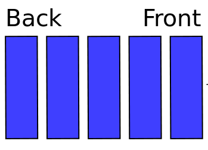
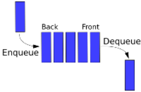
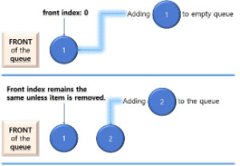

# Lab 05 - Creating a Queue
## 1. Introduction
Today you will create a queue class using either linked lists or an array implementation, that part is up to you. The goal of this lab is to give you a deeper understanding of the queue data structure.

## 2. STL & Queues
As you learned in the last lab, the STL (Standard Template Library) is a library of data structures for storing data. One of those data structures is a queue. 

Queues can also be referred to FIFO(First In First Out) lists. Queues are similar to stacks in the way that you can only remove elements from one side of the queue at a time. However, in this data structure we add elements to the back of the queue and remove elements from the front.


> Fig 2.0 Example of a queue storing any type of element. The element farthest to the right is the front element and next in line to be removed. The back element will be replaced by a new element if enqueue is called again.

#### Understanding Queue Operations
 
 Fundamental operations that can be performed on a queue are enqueue, dequeue, and front.

**Enqueue** is the equivalent of "insert," but it **inserts an item to the back** of a queue.

**Dequeue** is the equivalent of "delete", but it **deletes an item from the front** of a queue and then **returns** it.

**Front** will **return the element** that is at the **front** of the queue.



> Fig 2.1 Visualization of **enqueue**, an input operation, **dequeue** and **front**, output operations.

#### 2.2 Queue Behavior

The behavior of your queue should be as follows:

**Queue Initialization**
```c++
#include "queue.h"

int main(){
    Queue myQueue;
}
```
> Queue should be declarable as it is above.

**Enqueue & Dequeue**
```c++
#include <iostream>
#include "queue.hpp"

int main(){
    Queue myQueue;
    for (int i = 1; i <= 5; ++i){
        myQueue.enqueue(i);
    }

    std::cout << "Dequeued elements: "; 
    while(!myQueue.empty()){
        std::cout << ' ' << myQueue.dequeue();
    }
    std::cout << std::endl;
}
```
**Output:**
> Dequeued elements: 1 2 3 4 5

**Front**

```c++
#include <iostream>
#include "queue.hpp"

int main(){
    Queue myQueue;
    myQueue.enqueue(50);
    myQueue.enqueue(100);

    int x = myQueue.front();

    x += 50;

    std::cout << "x is " << x << std::endl;
}
```
**Output:**
> x is 100

**Empty**
```c++
#include <iostream>
#include "queue.hpp"

int main(){
    Queue myQueue;
    int sum = 0;

    for (int i = 1; i <= 15; ++i){
        myQueue.enqueue(i);
    }

    while(!myQueue.empty()){
        sum += myQueue.dequeue();
    }
    std::cout << "Sum = " << sum << std::endl;
}
```
**Output:**
> Sum = 120

**Size**
```c++
#include <iostream>
#include "queue.hpp"

int main(){
    Queue myQueue;
    for (int i = 0; i < 10; ++i){
        myQueue.enqueue(i + 1);
    }
    std::cout << "Size: " << myQueue.size() << std::endl;
    myQueue.dequeue();
    std::cout << "Size: " << myQueue.size() << std::endl;
}
```
**Output:**
> Size: 10
> Size: 9

## 3.0 Choose your Algorithm

You can choose to implement your queue in one of two ways. For both of these implementations, enqueueing elements is somewhat simple, but dequeueing can be tricky.

#### 3.1 Array Implementation

For this implementation you will need to efficiently manage array indices. When implementing a queue as an array you enqueue an element to the back and dequeue from the front. If you simply increment your indices linearly, you may run into issues like reaching the end of the array when there is still space to enqueue. Done correctly, the time complexity of all operations can be O(1).


> Enqueueing 2 elements in an array implementation

To help you understand how this implementation works, take some time to look at this interactive visualization of a queue using arrays: [Array Visualization](https://www.cs.usfca.edu/~galles/visualization/QueueArray.html)

#### 3.2 Linked List Implementation

A queue can also be implemented as a linked list that only allows removal from one end and insertion to the other. For this implementation you will not need to worry about running out of space in your queue. You will, however, have to efficiently manage the memory addresses of the nodes that make up the queue. Done correctly, the time complexity of all operations can be O(1), but without careful planning, the linked list implementation can increase complexity exponentially.


> Simple representation of a linked list queue

To help you understand how the linked list implementation works, take a look at this interactive visualization: [Linked List Visualization](https://www.cs.usfca.edu/~galles/visualization/QueueLL.html)

#### 3.3 Make a Queue with your crew

Now that you understand the basics of queues, with your group, decide on which implementation you would like to use. Your **objective** for this lab is to implement a queue using an array or linked list.

## 4.0 Starter Code

You will receive a header file with the required methods for a queue. **Some pieces** of the header file **are missing** and will depend on the implementation your group decides on. 

## 5.0 Submission

Your submission for this lab will include your 'lab-05.hpp' and 'lab-05.cpp' files containing your implementation of a queue.

* If you are unable to finish, you should submit the files containing what you were able to complete.

