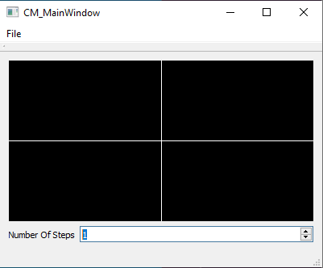
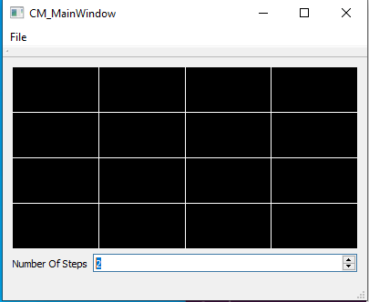
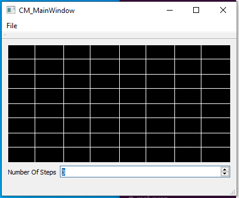

# Lab 06: Lab + Recursion(6) = Lab + (Lab + Recursion(5))

## Introduction

Recursion is the practice of breaking a complicated problem down into small, trivially solvable pieces, and then merging those pieces together to solve the full problem completely. 
Today you will be implementing a few recursive algorithms. 
The neat thing about recursion is that you can solve problems with a relatively small amount of well thought out code.

## A Quick Review of Recursion

In its simplest form, recursion is simply when a function calls itself within its own body. 
When a recursive function calls itself, a new stack frame is pushed onto the call stack with a slightly different set of parameters (if the parameters do not change it may recurse forever!). 
Calling itself allows the function to start again from the first line using the new parameters. 
The function call associated with this new stack frame will likely reach a point where it calls itself again, creating yet another stack frame with, again, with slightly different parameters.  This process repeats until the base case is reached.

At first, this may seem like an infinite loop of sorts, but if the function is implemented correctly, the input should be modified at each call such that the parameters get closer to triggering the base case. 
In the base case, some non-recursive code is executed, and the function is able to return to whichever stack frame came before it, picking up where it left off. 
One by one, each call to the recursive function will complete, having done some processing on the input, and return its own result. 
If the function is implemented without a base case, or continually recurses without reaching one, the program will instead crash with a stack overflow error.

### How to think about recursive function calls


In the above diagram, each box is a call to the recursive function `foo`. 
In the base case, simple, often times even trivial, steps are taken for some special case of the input. 
After returning from the base case, each call to `foo` may *use* the result returned to it and return to its caller.

**Note:** Each deeper level of recursion is solving a smaller problem, so when you think of a recursive algorithm, you will often ask yourself three questions: "How can I make this input smaller?", "What is the base case I am working towards?" and "How do I use solutions to the smaller problem to solve the bigger problem?"


## Drawing Fractals with QtCreator

### Definitions
We have defined some wrapper functionality for you, so what is to follow will be some definitions of things we have provided for you.

#### Steps
Any function with a `steps` parameter should treat steps as being how deep the recursion will go. For example, drawing a grid recursively with steps = 1 should produce 4 squares. Steps = 2 should produce a grid with 16 squares etc. Here are some images of the gui we have showing steps = 1, steps = 2 and steps = 3 respectively:





#### drawLine Functions
We have defined a few draw line functions for you (so you dont have to try and figure out QT gui aspects today). There are two of these functions: 

`drawLine(int x1, int y1, int x2, int y2);` 

`drawLineF(float x1, float y1, float x2, float y2);` 

Both of these functions take similar arguments (the only difference being their data types). Their arguments represent the two points you want to draw a line between, specifically they represent the points (x1, y1) and (x2, y2). It is also important to note that these functions exist as methods on a rederer object of type `CM_Renderer` so any function you write to do these drawings must also pass around a `CM_Renderer` parameter so every level of your function can draw a line.

#### Grid Lines
Drawing grid lines is one of the simplest implementations of a recursive drawing algorithm. Your function should have the header:
```C++
void grid(CM_Renderer *renderer, float top, float right, float bottom, float left, int steps)
```
With some psuedocode as follows to get you started today:
```C++
void grid(CM_Renderer *renderer, float top, float right, float bottom, float left, int steps) {
    if steps == 0 return
    otherwise {
        // Determine endpoints for both lines you need to draw for this recursive 
        // step (hint: think of the center of the area you are drawing in)

        // Draw both lines

        // Recurse on all 4 quadrants with a smaller step value
    }
}
```

<!---
We first check if `steps` is zero, if this is true then return nothing. 
We then want to define variables for the center of the grid, meaning we want to know where our drawing will begin based on the size of the canvas. We then use these coordinates for x and y to draw two lines.
Finally, the function will make four recursive calls for each corner of the grid. 
I.E. a recursive call for the top right of the grid, the top left, bottom left, and bottom right.
--->

#### Rectangles
This function begins by checking if `steps` is zero, if this is true, it returns nothing, completing it's task.
Otherwise, it draws its shape, using 'drawLine' or 'drawLineF'.
Finally, it calls itself four seperate times with new coordinates for each call, along with a reduced `steps`. 
It is this reduction in `steps` which gradually moves the function towards it's own base case.
We reduce the length at each call,  meaning that this function begins by drawing the largest shape, then progressively smaller ones. 


#### Sierpinski Triangle
Begin by looking at the figure below, examine the shape you are trying to draw. 


> Hint: The tip of the bottom left triangle should be halfway along the left line of the outer triangle, same with the bottom right and the right line. 

#### Snowflake
Finally, implement `snowflake`.
For this function, you will need `x1 = cos(radians(60))*length/2` and `y1 = sin(radians(60))*length/2`, they represent the diagonal parts of the snowflake.  Ask the TAs for help if needed. 
Don't forget to also use `-x1, -y1` to handle the negative portion of the diagonals.


## Submission

Submit all of your source code, including `Fractal.cpp'.