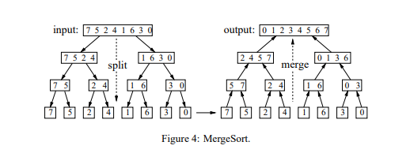

# Lab 8: Mergesort & Quicksort

## 1. Introduction

Today you will be working with two of the most commonly used sorting algorithms, Mergesort and Quicksort. 
While both algorithms are impressive, they each also have their own strengths and weaknesses. 
In this lab, you will implement slightly different variations of the mergesort and quicksort algorithms you have seen in lecture, and explore their limitations. 

>As always, be sure to carefully read this whole document.

## 2. Starter Code

The starter code for this lab contains a fairly large amount of components, but luckily for you, you only need to worry about a handful of functions.

```c++
void merge(int* A, int n, int mid);
void merge_sort(int* A, int n);
void merge_sort_plus(int* A, int n);
std::pair<int, int> partition(int* A, int lo, int hi);
void quicksort(int* A, int lo, int hi);
```

These are the functions you are required to implement for this lab. 
The `merge` function is necessary for implementing mergesort and improved mergesort (`merge_sort_plus`), and the `partition` function is necessary for implementing Quicksort. 
Each one will be explained more in-depth in their respective sections.

```c++
int* gen_list_unsorted(int size, int low, int high);
bool compare_arrays(int* A, int* B, int n);
bool test_merge(int n, int t);
bool test_merge_sort(int n, int t);
bool test_merge_sort_plus(int n, int t);
bool test_quicksort(int n, int t);
void custom_test(int n);
```

These are all the functions that are used to test your implementations. 
Each of the `test_` functions will generate a randomized array using `gen_list_unsorted`, solve the problem on one copy of the array (but not in a way that will help your implementation), run your implementation on the other copy, and compare the results using `compare_array`. 
**This is all handled for you**, so you don't need to worry much about it. 
However, the `custom_test` function allows you to take advantage of the structure of the program to test your implementations. 
You may write any tests you would like in it, and the value for `n` will be passed in automatically, so you don't need to worry about manually calling it.

The `main` in this program does a lot of different things that you don't really need to worry about, but what you do need to know is **how to use the program**. 
The program takes two arguments: either `merge`, `merge_sort`, `merge_sort_plus` `quicksort`, or `custom`; and an array size to test on. 
This will run three randomized tests on the chosen function using arrays of your specified length, and will print a success or failure message for each one, (provided the program runs to completion), unless you choose `custom`, which will run your custom tests instead.

>**Important Note:** You *must* compile with the C++ 11 Standard in order for the starter code to work.
Example of how to compile: 
```
g++ lab7.cpp -std=c++11 -o lab7
```
Example of how to run the program:
```
./lab7 merge_sort 10
```

## 3. MergeSort

Mergesort is a divide and conquer algorithm that was invented by John von Neumann in 1945 [[*ref*](https://en.wikipedia.org/wiki/Merge_sort)]. 
It divides an input array into two halves, calls itself on the two halves and then merges the two sorted halves. 
Here is a [visualization of mergesort](https://www.cs.usfca.edu/~galles/visualization/ComparisonSort.html) to help understand the algorithm. 
As you can see, the idea behind mergesort is to break down a large array into smaller sub-arrays which can each be more quickly and easily sorted. 
Once these small arrays are sorted, they are *merged* together in such a way that the new array is itself sorted, hence the name _mergesort_. 
The algorithm is a classic use of recursion; breaking down large, complex problems into very small, simple problems.

Here is the visualization from Wikipedia which does a good job of showing the basic mergesort process:


Here is another visual which shows the _divide_ aspect of the algorithm on the left hand side, and the _conquer_ aspect of the algorithm on the right-hand side.



### 3.1 Implementing Merge

Merge algorithms are a family of algorithms that take multiple sorted lists as input and produce a single list as output, containing all the elements of the input lists in sorted order. [[*ref*](https://en.wikipedia.org/wiki/Merge_algorithm)]. 
Today you will be merging two lists together in linear time, and in linear space or less. 
Your goal will be to transform the whole array `A` to be sorted in non-decreasing order.

The function header you will be using is as follows, with the parameters described below:

```c++
void merge(int* A, int n, int mid);
```

* `A` is an array of integers of length `n`, where `A` from `0` to `mid-1` is sorted in non-decreasing order, and `A` from `mid` to `n-1` is also sorted in non-decreasing order. 
The whole array is not necessarily sorted in non-decreasing order. In other words, `A` represents two sorted lists which are concatenated at `mid`.

* `n` is the length of array `A`
* `mid`, while not necessarily the midpoint, is the index of the element in `A` where the second sorted section begins

Here is an example of an array `A`:


Loose pseudocode for the algorithm is as follows:

1. Allocate Memory Dynamically to a new array B with size n
2. Copy A to B
3. Scan through the two sorted sub-arrays in B, writing each lowest element back to A one-by-one
4. Deallocate Memory (B)

Once you feel that you're ready to test your `merge` function, you may compile your code and use the program to test your `merge` function as described in the *Starter Code* section. 
Do not move on to implementing `merge_sort` until you succeed on all three trials on both an even and an odd input size, each greater than 8. 
You will later test `merge_sort` and `quicksort` in the same way.

### 3.2 Implementing MergeSort

Now that you have merge implemented, it should be fairly easy to implement the full mergesort. 

>You must have a correct implementation of `merge()` in order to complete mergesort

The function header is as follows:

```c++
void merge_sort(int* A, int n);
```

Where:

* `A` is an array of potentially unsorted integers
* `n` is the length of array `A`

The goal is to sort A in non-decreasing order. 
This algorithm is recursive, so your function should also be recursive.

> Once again, make sure that your implementation passes all three tests on various input sizes before moving on.

### 3.3 Implementing Improved Mergesort

Although we know that mergesort is much faster than selection or insertion, and in fact it has the best possible asymptotic complexity for a comparison-based sorting algorithm, it turns out it can still be improved. 
We can cut the running time of mergesort substantially with some carefully considered modifications to the implementation. 
Implement the improvements below in the starter code's `merge_sort_plus` function.

##### Use insertion sort for small sub-arrays. 
We can improve most recursive algorithms by handling small cases differently. 
Switching to insertion sort for small sub-arrays will improve the running time of a typical mergesort implementation by 10 to 15 percent. 
Input sizes between 7 and 10 (inclusive) are good choices for switching over to insertion sort.

It is recommended that you write your own insertion sort function rather than cramming all the code into the merge_sort function.

##### Test whether the array is already in order. 
We can reduce the running time to be linear for arrays that are already in order by adding a test to skip a call to `merge()` if `a[mid]` is less than or equal to `a[mid+1]`. 
With this change, we still do all the recursive calls, but the running time for any sorted subarray is linear.

After implementing each improvement, test the function with test cases of various sizes, small and large, to verify that the algorithm still runs successfully. 
You may test your `merge_sort_plus` function just as you tested your other two implementations, except with the argument `merge_sort_plus` instead of `merge` or `merge_sort`. 
It will run the same way as before, providing success and/or failure messages.


### 3.4 Questions

> Question 1: What is the asymptotic complexity (Big O) of mergesort?

> Question 2: Why is insertion sort better than mergesort for small sub-arrays?

> Question 3: How does the change affect the running time and in what case does the change make the biggest improvement?

## 4. Quicksort

Quicksort is a systematic element placement sorting algorithm developed by British scientist Tony Hoare in 1959 [[*ref*](https://en.wikipedia.org/wiki/Quicksort)]. 
It sorts arrays by choosing one element at a certain index and rearranges elements in the array such that all elements less than or equal to the chosen element go to one side of the index and all elements greater than or equal to go to the other side of the index. 
This means that after partitioning the array, this element (called the *pivot*) is in its correct position (I.E. the pivot has been sorted), and Quicksort now calls itself on the sub arrays to the left and right of the pivot. 
There are different ways to implement this algorithm, based around how you choose your pivot. 
While in lecture you will likely have seen the Lomuto partitioning scheme, in this lab you will instead implement an improved partitioning scheme, which will be described in further detail below. 
If you would like to see a visualization of the regular (non-improved) version of Quicksort, you can find one [here](https://visualgo.net/en/sorting). 
Just click on the tab labeled "QUI" at the top.

Here is a picture showing the steps of Lomuto quicksort:


### 4.1 Implementing Quicksort with Improved Partitioning

Similarly to mergesort, you will need to implement two functions to fully implement Quicksort, one that partitions an array into two sub-arrays separated by a pivot, and a recursive function that utilizes the partitioning function to sort the entire array. 
The signatures for these two functions are as follows:

```c++
std::pair<int, int> partition(int* A, int lo, int hi);
```

```c++
void quicksort(int* A, int lo, int hi);
```

Where:

* `A` is an array of potentially unsorted integers
* `lo` is the index of the first element in the given array/sub-array
* `hi` is the index of the last element in the given array/sub-array
* `partition()` returns two indices `gt` and `lt` that are described in detail below

The partition function you will implement here varies from usual partitioning schemes in that once you pick a pivot (which will be the first element of the sub-array), you want your array to be split into three sections by the time the partitioning algorithm is finished: less than the pivot, equal to the pivot, and greater than the pivot. 
The advantage of partitioning in this manner is that you can recursively call quicksort on just the less-than and greater-than sections of the sub-array. 
This is particularly useful if the array contains many repeated elements.

Quicksort with improved partitioning does introduce one potential issue not present with many other partitioning algorithms, which is the need for two indices returned by `partition()`. 
Since C++ can't normally return multiple values, we avoid this issue by putting the values into a pair using `std::pair<int, int>`, which can be thought of as a 2-tuple with both the first and second values of type `int`. 
Here are a few things you may need in order to use a pair:

* `std::make_pair(var1, var2)` will create a pair given two variables, `var1` and `var2`. Provided the two values are `int`s, you can assign this to a variable of type `std::pair<int, int>`.

**Example**
```C++
int x = 1, y = 2;
std::pair<int, int> p = std::make_pair(x, y);
```
* Given a pair `p`, `p.first` and `p.second` will get the first and second values of the pair, respectively.
* Provided `<tuple>` is included, you can use the statement `std::tie(var1, var2) = p`, where `p` is a pair, and `var1` and `var2` are variables with types matching the pair (in this case both `int`) which have already been declared. This will take the values from `p` and put them into `var1` and `var2`. 

**Example**
```C++
int w = 1, x = 2, y, z;
std::pair<int, int> p = std::make_pair(w,x);
std::tie(y, z) = p;
std::cout << y << " " << z << std::endl;
```
> Output: 1 2

Pseudocode for the improved partition function is as follows, with `lt` representing the lowest index with a value equal to the partition, and `gt` representing the greatest such index:

1. Let `v` be the partitioning element, set to `A[lo]`
2. Scan `i` from left to right and repeatedly perform the following checks
  + `(A[i] < v)`: swap `A[lt]` with `A[i]` and increment `lt` and `i`
  + `(A[i] > v)`: swap `A[gt]` with `A[i]` and decrement `gt`
  + `(A[i] == v)`: increment `i`

Once you feel that you're ready to test your `quicksort` function, be sure to test it just as you have tested all other algorithms thus far. 
There is **no separate test for** `partition()`, so you may want to take advantage of the `custom()` testing function in order to make sure you are partitioning correctly.

### 4.3  Questions

> Question 4: What is the asymptotic complexity of quicksort?

> Question 5: Which type of input might quicksort perform poorly on?

> Question 6: Which algorithm is better for general use: quicksort of mergesort? Explain your reasoning.

## 5. Submission

Your submission for this lab will include the `lab7.cpp` file containing your implementations of `merge()`, `merge_sort()`, `merge_sort_plus()`, `partition()` and `quicksort()`, along with a `lab7.txt` file containing your answers to the questions.

* If your group was not able to successfully implement every function, you should submit the `lab7.cpp` file containing everything you were able to implement. Ideally, the source code file you submit should be able to compile. 