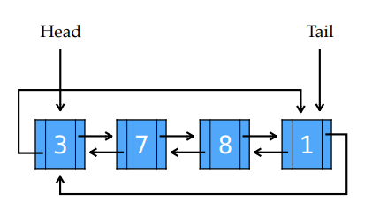
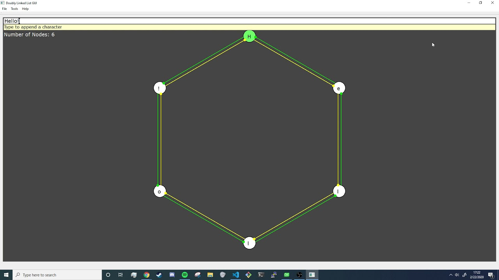

## Programming Assignment 02 (3/3)

This assignment is focused on Circular Doubly Linked Lists. The assignment is worth a total of 100 points. If you have any questions or need any help, please visit us during office hours and/or post questions on Piazza.

> If you need to post any of your actual source code on Piazza for any reason, **please** be sure to tag the post as being *visible to instructors only*, so that you don't inadvertently share code with others and violate class rules.

### Linked Lists
-----
Lists are one of the most common and versatile data structures and are essential to many C and C++ programs. As we have discussed over the past few weeks, C-style arrays provide `O(1)` time random access to elements, but can have potentially high costs `O(n)` during insertion and deletion operations. Linked Lists, on the other hand, can grow and shrink dynamically in `O(1)` time. They allow us to store hundreds, or even thousands, of elements inside of memory while providing the ability to insert and delete elements quickly.

### Circular Doubly Linked Lists
-----
Circular Doubly Linked Lists are a particular type of linked list where each node holds a pointer to the next, as well as the previous, node in the list. The 'previous' node of the `head` of the list, is the `tail` and the 'next' node of the `tail` node, is the `head`.



The goal of this assignment is to implement your own Circular Doubly Linked List Class in C++. This linked list data structure for this assignment will store characters instead of integers.

### Code Handout
-----
In order to implement your own class, we are providing starter code. You will be given a *header file* (`.h`) and a partially-implemented *source file* (`.cpp`) for a class `DoublyLinkedList`.

```C++
#ifndef DOUBLYLINKEDLIST_H
#define DOUBLYLINKEDLIST_H

#include <string>

// Node data structure used by the linked list
struct Node {
    Node *previous;
    Node *next;
    char data;

    Node();
    Node(char c);
};

class DoublyLinkedList {
private:
    Node *m_head; // always points to the beginning of the list
    Node *m_tail; // always points to the end of the list
    int m_node_count; // represents the number of nodes in the list

public:
    DoublyLinkedList(); // default constructor
    DoublyLinkedList(const DoublyLinkedList &other); // copy constructor
    DoublyLinkedList(const std::string &data_string); // constructor with a specific string (provided)
    ~DoublyLinkedList(); // destructor

    // add to the end of the list
    // --- (15 pts)
    void append(char data);

    // add to the beginning of the list
    // --- (15 pts)
    void prepend(char data);

    // insert into the list by index (index = 0 means insert at the beginning of the list)
    // --- (15 pts)
    void insert(int index, char data);

    // remove from the end of the list
    // --- (10 pts)
    void removeLast();

    // remove from the beginning of the list
    // --- (10 pts)
    void removeFirst();

    // remove from a specific position in the list
    // --- (10 pts)
    void removeAt(int index);

    // remove all nodes from the linked list
    // --- (5 pts)
    void clear();

    // get a value at a position in the linked list
    // --- (5 pts)
    char get(int index) const;

    // modify a value at a position in the linked list
    // --- (5 pts)
    void set(int index, char new_value);

    // find the first occurence of "search char" in the linked list and return its index position. Return -1 if the character is not found.
    // --- (5 pts)
    int findFirstOf(char search_char) const;

    // find the last occurence of "search_char" in the linked list and return its index position. Return -1 if the character is not found.
    // --- (5 pts)
    int findLastOf(char search_char) const;

    // functions that you do NOT have to implement and should not change
    DoublyLinkedList& operator=(const DoublyLinkedList &other); //deep copy assignment operator
    char operator[](int index) const; //does the same thing as the get function
    Node *firstNode(); //get the first node
    int getSize() const; //get the number of items in the list
    std::string toString() const; //get the data in the linked list as a printable string
};

#endif // DOUBLYLINKEDLIST_H
```

Some functions have already been implemented for you inside of the `.cpp` file. The rest of the functions are up to you to implement. You may add your own _private_ functions should you wish.

>Note: You are _not_ allowed to alter any of the given private variables, public function signatures or implementations.

### Pair Programming
-----
For this assignment, you are __required__ to choose a *single* partner **from your lab section** with whom you will work to complete the assignment. We feel that this will be a good chance, not only to experience pair programming (which is often mandated in upper level CS courses), but to hopefully gain knowledge by working with someone else.

> Note: For any given part of the assignment, both partners must be able to understand and explain design choices and functionality.

When you submit your code, please make sure to submit together to Gradescope as a group. You may **not** share your code with others outside your group.

### Code Interviews
-----
For this assignment, part of your grade will be a code interview where you will sit with a TA or Instructor. You will explain how your code works and why you made certain decisions, as well as answer some questions. These interviews will account for `30%` of your final grade; the other `70%` will be based on the functional correctness and quality of your code.

This grading scheme is meant to make sure not only that your code works functionally, but also that you understand why it works. If you understand your code and the problem but don't have perfectly functional code, this is a chance for you to get a better grade. If, on the other hand, your code is functionally perfect but you don't understand it, you may be penalized.

### Local Testing
----
There is _no_ autograder for this assignment. This means that you will not receive immediate feedback upon submission. For this reason, you must test your code locally to look for errors. In computer science, the importance of testing your code locally cannot be emphasized enough. Whenever you write a function for your program, you should be testing it rigorously to ensure that it works as you intend. You can do this by writing a `main.cpp` where you test multiple functions and print the state of the list after each operation. During code interviews you should expect to be asked how you tested the code that you wrote during development. If you would like help testing your code or making sure it meets expectations, we are happy to help during office hours or via Piazza.

### GUI Component
-----
Our TA Chris has taken some time to create a graphical component for this project using [Qt Creator](https://www.qt.io/product) (environment and libraries for UI development). This will allow you to visualize your code once you have it working. Please follow the [instructions to install Qt Creator](./qt.md) on your computer if you have not already done so.

You should fully test your implementation with your own `main.cpp` driver as described above. Once you are confident in your solution, the graphical interface is just another way to verify the correctness of your solution (more details on this in the next section). If you want to have an idea of how the GUI should look with a correct implementation of `DoublyLinkedList`, watch the video linked below.

[](https://www.youtube.com/watch?v=oX2YIFodpGk&feature=youtu.be)

### GUI Usage
----
The GUI is primarily used by typing characters like you would in a text entry field. This text entry field is displayed on the top of the main display. Underneath it is a circular wheel of values which shows the nodes, the characters they contain, and the connections they have to other nodes. If you mess up the connections you may see the connections point to "Garbage Value" or "NULL". This should never be the case with a circular doubly linked list. If this happens it means there is an error in your code. These functions test the linked list data structure. Pressing backspace or delete keys will delete characters which would test the removal functions of the linked list.

> Do not forget to update the variable that tracks the number of nodes in the linked list when using functions that add or remove nodes. This type of mistake will cause problems in the GUI.

### Recommended Approach
----
There are many functions that you will need to implement in the `DoublyLinkedList` class. If one of them is not implemented correctly, it can subsequently cause the other functions to not work correctly. When functions fail in this way, it can be difficult to isolate the failing point. To avoid this, it is suggested that you implement the functions in the following order.

1. append
2. clear
3. prepend
4. removeLast
5. removeFirst
6. find functions
7. removeAt
8. insert

Write and test each function _thoroughly_ before moving on to the next one to ensure quality code.

### Submission and Grading
---
When you go to submit to gradescope you will see two assignments `section 1` and `section 2`, you should submit your assignment under the submission corresponding to your lab section. (ie. if you are in the 10:00-11:45 AM section, submit to `section 1`, if you are in the 12:00-1:45 PM section, submit to `section 2`). If you and your partner are from different lab sections, submit under `section 1`. Please make sure to submit to the correct section, or you may lose points. To submit your solution to Gradescope, simply select `DoublyLinkedList.cpp` and `DoublyLinkedList.h` then use the *drag and drop* option. You will not receive immediate feedback so test your code locally first.

> You must be reminded that students caught cheating or plagiarizing will receive `no credit`. Additional actions, including a failing grade in the class or referring the case for disciplinary action, may also be taken.
